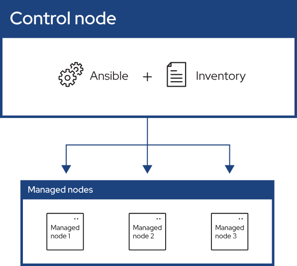

# Welcome to Ansible Tutorials

### Why do we need Ansible?
> It solves the problem faced by the System Administrator(Maintain the configuration and dependencies for product). 

### What is Ansible??
> Ansible is an open source IT automation engine that automates provisioning, configuration management, application deployment, orchestration, and many other IT processes. 

### Componets of Ansible:
- Control Node: It is the Node on which the ansible is installed. 
- Inventory: List of the managed nodes 
- Managed Nodes: It is the node which is controlled by the control node. 

